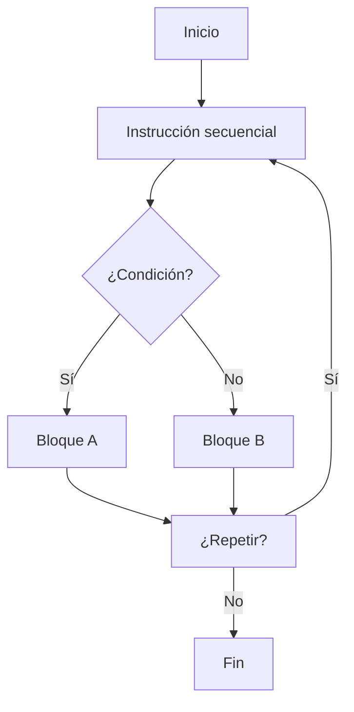
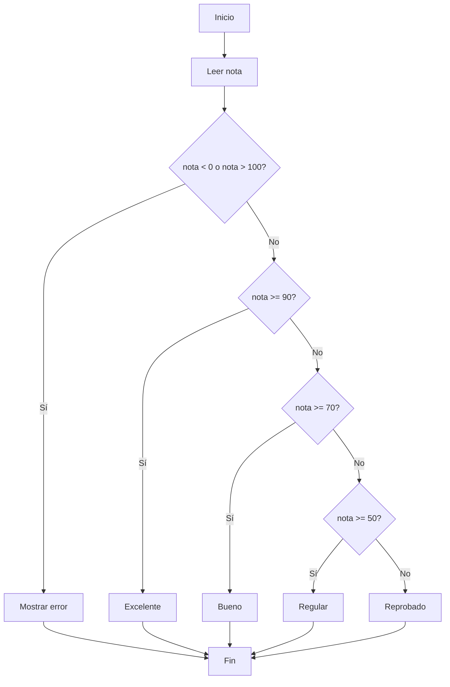
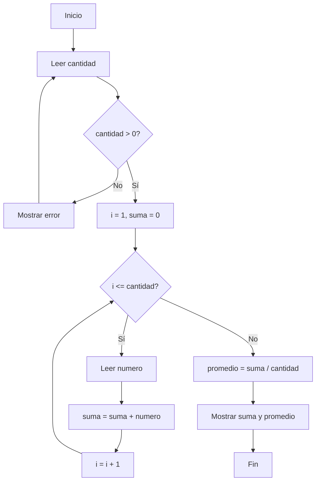
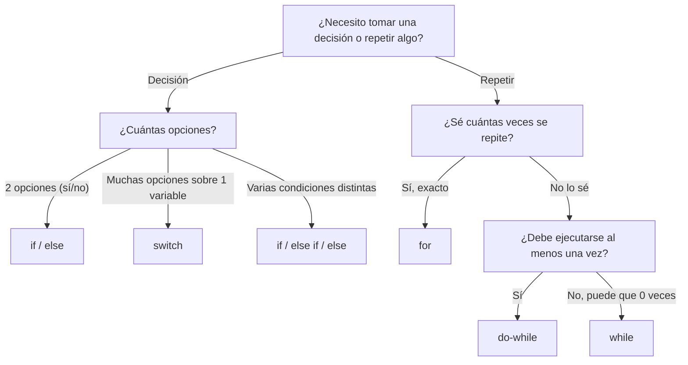

# Tema 3: Estructuras de Control

**Guía de estudio — Programación I**

> **Contenido de esta guía:**
> - **3.1** Desarrollar un algoritmo para resolver un problema práctico aplicando estructuras condicionales (`if`, `else`, `if-else`, `switch`).
> - **3.2** Aplicar en un algoritmo estructuras del tipo Bucles e iteraciones (`for`, `while`, `do-while`).
>
> Todos los ejemplos se muestran en **dos herramientas**: **PSeint** (para diseñar la lógica en español) y **C#** (para implementarla como programa real). La idea es que compares ambos y entiendas que **la lógica no cambia, solo la sintaxis**.

---

## Índice

1. [Introducción a las estructuras de control](#1-introducción-a-las-estructuras-de-control)
2. [3.1 Estructuras condicionales](#2-31-estructuras-condicionales)
   - [2.1 ¿Qué son y para qué sirven?](#21-qué-son-y-para-qué-sirven)
   - [2.2 if / else](#22-if--else)
   - [2.3 if-else if-else (condiciones encadenadas)](#23-if-else-if-else-condiciones-encadenadas)
   - [2.4 switch / Segun](#24-switch--segun)
   - [2.5 Algoritmo práctico resuelto paso a paso](#25-algoritmo-práctico-resuelto-paso-a-paso)
   - [2.6 Errores comunes](#26-errores-comunes)
3. [3.2 Bucles e iteraciones](#3-32-bucles-e-iteraciones)
   - [3.1 ¿Qué son y para qué sirven?](#31-qué-son-y-para-qué-sirven)
   - [3.2 for / Para](#32-for--para)
   - [3.3 while / Mientras](#33-while--mientras)
   - [3.4 do-while / Repetir...Hasta Que](#34-do-while--repetirhasta-que)
   - [3.5 Algoritmo práctico resuelto paso a paso](#35-algoritmo-práctico-resuelto-paso-a-paso)
   - [3.6 Errores comunes](#36-errores-comunes)
4. [Tabla comparativa general (C# vs PSeint)](#4-tabla-comparativa-general-c-vs-pseint)
5. [Cómo elegir la estructura correcta](#5-cómo-elegir-la-estructura-correcta)
6. [Ejercicios propuestos](#6-ejercicios-propuestos)
7. [Glosario rápido](#7-glosario-rápido)

---

## 1. Introducción a las estructuras de control

Un algoritmo, por defecto, se ejecuta **de forma secuencial**: una instrucción tras otra, de arriba hacia abajo. Sin embargo, la mayoría de los problemas reales necesitan que el programa:

- **Tome decisiones** → usa **estructuras condicionales** (`if`, `else`, `switch`).
- **Repita tareas** → usa **estructuras repetitivas o bucles** (`for`, `while`, `do-while`).



> 💡 **Idea clave:** las estructuras condicionales controlan **qué** se ejecuta, y los bucles controlan **cuántas veces** se ejecuta.

---

## 2. 3.1 Estructuras condicionales

### 2.1 ¿Qué son y para qué sirven?

Las estructuras condicionales permiten que el programa **evalúe una condición lógica** (verdadera o falsa) y, según el resultado, ejecute un bloque de instrucciones u otro.

**Usos típicos:**
- Validar datos ingresados por el usuario.
- Clasificar valores en rangos o categorías.
- Controlar el flujo de un menú de opciones.
- Aplicar reglas de negocio (descuentos, permisos, condiciones de aprobación, etc.).

### 2.2 if / else

| | C# | PSeint |
|---|---|---|
| Sintaxis | `if (condicion) { }` | `Si condicion Entonces ... FinSi` |
| Con alternativa | `if (condicion) { } else { }` | `Si condicion Entonces ... SiNo ... FinSi` |

**C#**
```csharp
if (edad >= 18)
{
    Console.WriteLine("Es mayor de edad");
}
else
{
    Console.WriteLine("Es menor de edad");
}
```

**PSeint**
```text
Si edad >= 18 Entonces
    Escribir "Es mayor de edad";
SiNo
    Escribir "Es menor de edad";
FinSi
```

**Puntos clave:**
- En C#, la condición va **entre paréntesis** `()` y el bloque **entre llaves** `{}`.
- En PSeint, no se usan paréntesis ni llaves: se delimita con las palabras clave `Entonces`, `SiNo` y `FinSi`.
- El `else` / `SiNo` es **opcional**: se puede usar un `if` sin alternativa si no se necesita.

### 2.3 if-else if-else (condiciones encadenadas)

Se usa cuando hay **más de dos posibles caminos**.

**C#**
```csharp
if (nota >= 90)
{
    Console.WriteLine("Excelente");
}
else if (nota >= 70)
{
    Console.WriteLine("Bueno");
}
else if (nota >= 50)
{
    Console.WriteLine("Regular");
}
else
{
    Console.WriteLine("Reprobado");
}
```

**PSeint**
```text
Si nota >= 90 Entonces
    Escribir "Excelente";
SiNo
    Si nota >= 70 Entonces
        Escribir "Bueno";
    SiNo
        Si nota >= 50 Entonces
            Escribir "Regular";
        SiNo
            Escribir "Reprobado";
        FinSi
    FinSi
FinSi
```

> ⚠️ **Diferencia importante:** en C#, `else if` es una construcción directa. En PSeint **no existe un "SiNo Si" nativo**: cada condición adicional requiere un nuevo `Si...FinSi` **anidado dentro del SiNo** anterior. Por eso el código en PSeint queda más indentado (anidado) que en C#.

### 2.4 switch / Segun

Se usa cuando se compara **una misma variable contra varios valores posibles** (alternativa más ordenada que muchos `if-else` encadenados).

**C#**
```csharp
switch (diaSemana)
{
    case 1:
        Console.WriteLine("Lunes");
        break;
    case 2:
        Console.WriteLine("Martes");
        break;
    default:
        Console.WriteLine("Otro día");
        break;
}
```

**PSeint**
```text
Segun diaSemana Hacer
    1:
        Escribir "Lunes";
    2:
        Escribir "Martes";
    De Otro Modo:
        Escribir "Otro dia";
FinSegun
```

**Puntos clave:**
- En C#, **cada `case` necesita `break;`** para no continuar ejecutando el siguiente caso (esto se llama *fall-through* si se olvida).
- `default` en C# equivale a `De Otro Modo` en PSeint: el caso que se ejecuta si ningún valor coincide.
- El `switch` es más legible que una cadena larga de `if-else if` cuando se comparan **valores exactos** de una sola variable.

### 2.5 Algoritmo práctico resuelto paso a paso

**Problema:** Clasificar a un estudiante según su nota final (0-100):

| Rango | Calificación |
|---|---|
| 90 - 100 | Excelente |
| 70 - 89 | Bueno |
| 50 - 69 | Regular |
| 0 - 49 | Reprobado |

También se debe **validar** que la nota esté entre 0 y 100.

**Paso 1 — Identificar entradas y salidas**
- Entrada: `nota` (número entero entre 0 y 100)
- Salida: texto con la calificación, o mensaje de error

**Paso 2 — Diseñar la lógica (diagrama de flujo simplificado)**



**Paso 3 — Escribir el algoritmo en PSeint**
```text
Algoritmo ClasificacionEstudiante
    Definir nota Como Entero;
    Escribir "Ingrese la nota final del estudiante (0-100):";
    Leer nota;

    Si nota < 0 O nota > 100 Entonces
        Escribir "Error: la nota debe estar entre 0 y 100";
    SiNo
        Si nota >= 90 Entonces
            Escribir "Calificacion: Excelente";
        SiNo
            Si nota >= 70 Entonces
                Escribir "Calificacion: Bueno";
            SiNo
                Si nota >= 50 Entonces
                    Escribir "Calificacion: Regular";
                SiNo
                    Escribir "Calificacion: Reprobado";
                FinSi
            FinSi
        FinSi
    FinSi
FinAlgoritmo
```

**Paso 4 — Traducir la lógica a C#**
```csharp
using System;

class ClasificacionEstudiante
{
    static void Main()
    {
        Console.WriteLine("Ingrese la nota final del estudiante (0-100):");
        int nota = Convert.ToInt32(Console.ReadLine());

        if (nota < 0 || nota > 100)
        {
            Console.WriteLine("Error: la nota debe estar entre 0 y 100");
        }
        else if (nota >= 90)
        {
            Console.WriteLine("Calificacion: Excelente");
        }
        else if (nota >= 70)
        {
            Console.WriteLine("Calificacion: Bueno");
        }
        else if (nota >= 50)
        {
            Console.WriteLine("Calificacion: Regular");
        }
        else
        {
            Console.WriteLine("Calificacion: Reprobado");
        }
    }
}
```

**Paso 5 — Probar con casos límite**

| Nota ingresada | Resultado esperado |
|---|---|
| 95 | Excelente |
| 89 | Bueno |
| 70 | Bueno |
| 69 | Regular |
| 49 | Reprobado |
| -5 | Error |
| 150 | Error |

> ✅ **Tip de estudio:** siempre prueba los **valores límite** (los bordes de cada rango, como 89, 90, 69, 70) — es donde más se cometen errores de lógica.

### 2.6 Errores comunes

| Error | Ejemplo | Consecuencia |
|---|---|---|
| Olvidar `break;` en `switch` (C#) | falta `break;` en un `case` | Se ejecutan los casos siguientes sin querer (*fall-through*) |
| Confundir `=` con `==` (C#) | `if (x = 5)` | Error de compilación (asignación en vez de comparación) |
| Olvidar `FinSi` (PSeint) | falta cerrar un `Si` | Error de sintaxis en PSeint |
| Anidar mal los `Si...SiNo` (PSeint) | indentación incorrecta | La lógica no evalúa lo que se esperaba |
| No validar rangos de entrada | no verificar que la nota esté entre 0-100 | El programa "funciona" pero da resultados sin sentido |

---

## 3. 3.2 Bucles e iteraciones

### 3.1 ¿Qué son y para qué sirven?

Los bucles permiten **repetir un bloque de instrucciones** varias veces sin tener que escribirlo manualmente cada vez.

**Usos típicos:**
- Recorrer una lista de datos.
- Acumular sumas, contadores o promedios.
- Repetir la solicitud de un dato hasta que sea válido.
- Mostrar menús que se repiten hasta que el usuario decide salir.

### 3.2 for / Para

Se usa cuando se conoce **de antemano cuántas veces** se debe repetir el bloque (bucle **contado**).

**C#**
```csharp
for (int i = 1; i <= 5; i++)
{
    Console.WriteLine(i);
}
```

**PSeint**
```text
Para i <- 1 Hasta 5 Con Paso 1 Hacer
    Escribir i;
FinPara
```

**Partes del `for` en C#:**
1. **Inicialización**: `int i = 1;` (se ejecuta una sola vez, al inicio)
2. **Condición**: `i <= 5;` (se evalúa antes de cada repetición)
3. **Incremento**: `i++` (se ejecuta al final de cada repetición)

En PSeint, `Para i <- 1 Hasta 5 Con Paso 1` agrupa las tres partes en una sola línea: valor inicial, valor final y paso (incremento).

### 3.3 while / Mientras

Se usa cuando **no se sabe de antemano** cuántas veces se repetirá, sino que depende de una condición. La condición se evalúa **antes** de cada repetición (por lo tanto, puede ejecutarse **cero veces**).

**C#**
```csharp
int i = 1;
while (i <= 5)
{
    Console.WriteLine(i);
    i++;
}
```

**PSeint**
```text
i <- 1;
Mientras i <= 5 Hacer
    Escribir i;
    i <- i + 1;
FinMientras
```

> ⚠️ **Cuidado:** si olvidas actualizar la variable de control (`i++` / `i <- i + 1`), el bucle **nunca termina** (bucle infinito).

### 3.4 do-while / Repetir...Hasta Que

Se usa cuando el bloque debe ejecutarse **al menos una vez**, sin importar la condición, porque esta se evalúa **al final**.

**C#**
```csharp
int j = 1;
do
{
    Console.WriteLine(j);
    j++;
} while (j <= 5);
```

**PSeint**
```text
j <- 1;
Repetir
    Escribir j;
    j <- j + 1;
Hasta Que j > 5
```

> ⚠️ **Diferencia clave (muy preguntada en exámenes):** `do-while` en C# **continúa repitiendo mientras la condición sea verdadera**. `Repetir...Hasta Que` en PSeint **termina cuando la condición se cumple** (es decir, la condición de salida está invertida). Por eso `j <= 5` en C# equivale a `j > 5` en PSeint para lograr el mismo resultado.

**¿Cuándo usar cada bucle?**

| Situación | Estructura recomendada |
|---|---|
| Sé exactamente cuántas veces repetir | `for` / `Para` |
| No sé cuántas veces, y puede que no se ejecute nunca | `while` / `Mientras` |
| No sé cuántas veces, pero debe ejecutarse **al menos una vez** (ej. validaciones, menús) | `do-while` / `Repetir...Hasta Que` |

### 3.5 Algoritmo práctico resuelto paso a paso

**Problema:** Solicitar al usuario cuántos números desea sumar (debe ser mayor a 0, si no se vuelve a pedir), luego leer cada número y calcular la **suma total** y el **promedio**.

**Paso 1 — Identificar entradas y salidas**
- Entradas: `cantidad` (validada > 0), y `cantidad` números
- Salidas: `suma` total y `promedio`

**Paso 2 — Diseñar la lógica (diagrama de flujo simplificado)**



**Paso 3 — Escribir el algoritmo en PSeint**
```text
Algoritmo SumaYPromedio
    Definir cantidad, numero, i Como Entero;
    Definir suma, promedio Como Real;

    Repetir
        Escribir "Ingrese la cantidad de numeros a sumar:";
        Leer cantidad;
        Si cantidad <= 0 Entonces
            Escribir "Debe ingresar un numero mayor a 0";
        FinSi
    Hasta Que cantidad > 0

    suma <- 0;
    Para i <- 1 Hasta cantidad Con Paso 1 Hacer
        Escribir "Ingrese el numero ", i, ":";
        Leer numero;
        suma <- suma + numero;
    FinPara

    promedio <- suma / cantidad;
    Escribir "La suma total es: ", suma;
    Escribir "El promedio es: ", promedio;
FinAlgoritmo
```

**Paso 4 — Traducir la lógica a C#**
```csharp
using System;

class SumaYPromedio
{
    static void Main()
    {
        int cantidad, numero;
        double suma = 0, promedio;

        do
        {
            Console.WriteLine("Ingrese la cantidad de numeros a sumar:");
            cantidad = Convert.ToInt32(Console.ReadLine());
            if (cantidad <= 0)
            {
                Console.WriteLine("Debe ingresar un numero mayor a 0");
            }
        } while (cantidad <= 0);

        for (int i = 1; i <= cantidad; i++)
        {
            Console.WriteLine($"Ingrese el numero {i}:");
            numero = Convert.ToInt32(Console.ReadLine());
            suma += numero;
        }

        promedio = suma / cantidad;
        Console.WriteLine($"La suma total es: {suma}");
        Console.WriteLine($"El promedio es: {promedio}");
    }
}
```

**Paso 5 — Probar con casos de ejemplo**

| Entrada (`cantidad`) | Números | Suma esperada | Promedio esperado |
|---|---|---|---|
| 3 | 10, 20, 30 | 60 | 20 |
| 1 | 7 | 7 | 7 |
| -2 (inválido) | — | (pide de nuevo) | — |

### 3.6 Errores comunes

| Error | Ejemplo | Consecuencia |
|---|---|---|
| Bucle infinito | olvidar `i++` / `i <- i + 1` | El programa nunca termina |
| Confundir `Repetir...Hasta Que` con `do-while` | usar la misma condición sin invertirla | El bucle hace lo contrario de lo esperado |
| Off-by-one (error de límite) | usar `<` en vez de `<=` | Se repite una vez de más o de menos |
| No inicializar el acumulador | no poner `suma <- 0;` antes del bucle | La suma arrastra un valor incorrecto |
| Elegir el bucle incorrecto | usar `for` cuando no se sabe cuántas veces repetir | Código más difícil de mantener |

---

## 4. Tabla comparativa general (C# vs PSeint)

| Estructura | PSeint | C# | ¿Cuándo se evalúa la condición? |
|---|---|---|---|
| Condicional simple | `Si...FinSi` | `if { }` | — |
| Condicional doble | `Si...SiNo...FinSi` | `if { } else { }` | — |
| Selección múltiple | `Segun...FinSegun` | `switch { }` | — |
| Bucle contado | `Para...FinPara` | `for (;;) { }` | Antes de cada iteración |
| Bucle condicional | `Mientras...FinMientras` | `while () { }` | Antes (puede ejecutarse 0 veces) |
| Bucle con validación | `Repetir...Hasta Que` | `do { } while ()` | Después (mínimo 1 vez) |
| Declarar variable | `Definir x Como Entero;` | `int x;` | — |
| Leer datos | `Leer x;` | `Console.ReadLine()` + conversión | — |
| Mostrar datos | `Escribir "texto";` | `Console.WriteLine("texto");` | — |
| Operador AND | `Y` | `&&` | — |
| Operador OR | `O` | `\|\|` | — |
| Operador NOT | `No` | `!` | — |

---

## 5. Cómo elegir la estructura correcta

Usa esta guía rápida de decisión antes de programar:



---

## 6. Ejercicios propuestos

Resuelve los siguientes ejercicios primero en **PSeint** y luego trata de traducirlos a **C#** por tu cuenta.

**Estructuras condicionales:**

1. Determinar si un número es par o impar.
2. Calcular el costo de un envío según el peso del paquete (usa `if-else if`).
3. Simular un menú de opciones (1: Sumar, 2: Restar, 3: Salir) usando `switch` / `Segun`.
4. Validar si una persona puede votar según su edad y si tiene cédula vigente (usa operadores lógicos `Y` / `&&`).

**Bucles e iteraciones:**

5. Mostrar la tabla de multiplicar de un número ingresado por el usuario (`for`).
6. Calcular el factorial de un número (`for` o `while`).
7. Pedir una contraseña repetidamente hasta que el usuario la escriba correctamente (`do-while` / `Repetir...Hasta Que`).
8. Sumar únicamente los números pares dentro de un rango dado por el usuario (`for` + `if`).
9. Crear un menú que se repita hasta que el usuario elija la opción "Salir" (`do-while` + `switch`).

> 📝 **Sugerencia de estudio:** para cada ejercicio, sigue los mismos 5 pasos usados en los algoritmos de ejemplo de esta guía: (1) identificar entradas/salidas, (2) diseñar la lógica, (3) escribirlo en PSeint, (4) traducirlo a C#, (5) probar con casos límite.

---

## 7. Glosario rápido

| Término | Definición |
|---|---|
| **Algoritmo** | Secuencia ordenada y finita de pasos para resolver un problema |
| **Condición** | Expresión que se evalúa como verdadera o falsa |
| **Estructura condicional** | Estructura que ejecuta un bloque u otro según una condición |
| **Bucle / iteración** | Estructura que repite un bloque de instrucciones |
| **Variable de control** | Variable que determina cuándo termina un bucle (ej. el contador `i`) |
| **Acumulador** | Variable que va sumando/acumulando valores dentro de un bucle (ej. `suma`) |
| **Bucle infinito** | Bucle cuya condición nunca se vuelve falsa (o verdadera, según el caso); nunca termina |
| **Caso límite (edge case)** | Valor en el borde de un rango, útil para probar que la lógica sea correcta |

---

*Guía elaborada para el estudio del Tema 3: Estructuras de Control — comparativa PSeint / C#.*