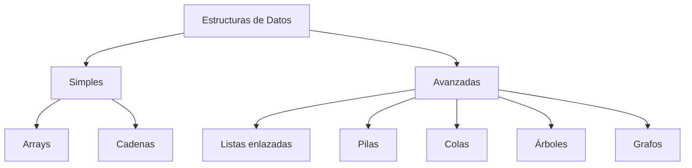

# 5.2 Introducción a Estructuras Avanzadas

### y su relevancia en el procesamiento seguro de datos

<br>

🔐 Estructuras de datos como base de sistemas robustos y seguros

<div class="pt-10">
  <span class="text-sm opacity-70">Módulo 5 · Estructuras de Datos · Ejemplos en C#</span>
</div>

<!--
Bienvenida a la clase. Contextualizar que este tema es la continuación natural
de 5.1, subiendo un nivel de complejidad hacia estructuras dinámicas.
-->

---
layout: default
class: text-base
---

# 📋 Agenda

<v-clicks>

1. Repaso rápido de 5.1: arrays, cadenas y estructuras simples
2. ¿Qué son las estructuras de datos avanzadas?
3. Listas enlazadas
4. Pilas (Stacks)
5. Colas (Queues)
6. Árboles
7. Grafos
8. Relevancia en el procesamiento seguro de datos
9. Vulnerabilidades comunes y cómo prevenirlas
10. Ejemplos prácticos de código en C#
11. Resumen y conclusiones
12. Recursos adicionales y preguntas

</v-clicks>

<!--
Dar una vista panorámica. No profundizar aún, solo situar al estudiante.
-->

---
layout: section
---

# Repaso: Tema 5.1

## Arrays, cadenas y estructuras simples

---
class: text-base
---

# Lo que ya sabemos hacer

<div class="grid grid-cols-2 gap-6">

<div>

### ✅ Arrays
- Acceso por índice O(1)
- Tamaño fijo o dinámico según el lenguaje
- Recorrido secuencial

### ✅ Cadenas (Strings)
- Validación de formato de entrada
- Búsqueda y manipulación de texto

</div>

<div>

```csharp
// Ejemplo típico de 5.1
string[] usuarios = { "ana", "luis", "eva" };
bool valido = usuarios.Contains("ana");
```

<v-click>

> 💡 **Limitación clave:** los arrays son eficientes, pero no siempre óptimos para inserciones/eliminaciones frecuentes ni para representar relaciones complejas entre datos.

</v-click>

</div>

</div>

---
class: text-base
---

# 🧩 ¿Qué son las estructuras avanzadas?

<div class="grid grid-cols-1 gap-6 items-center">

<div>

Son formas más sofisticadas de **organizar, relacionar y proteger** datos, diseñadas para resolver problemas que las estructuras simples no manejan bien:

- Inserciones/eliminaciones eficientes
- Relaciones jerárquicas
- Relaciones en red (no lineales)
- Control de flujo (orden de procesamiento)
- Trazabilidad e integridad de datos

</div>

<div>



</div>

</div>

<!--
Enfatizar que "avanzada" no significa "complicada sin razón": cada estructura
resuelve un problema concreto de eficiencia o de modelado de relaciones.
-->

---
class: text-base
---

# 🔗 Listas Enlazadas (Linked Lists)

<div class="grid grid-cols-2 gap-6">

<div>

### Características
- Nodos conectados mediante referencias
- Inserción/eliminación en O(1) con referencia directa
- No requieren memoria contigua
- Variantes: simple, doble, circular

</div>

<div>

### Casos de uso
- Historial de navegación (deshacer/rehacer)
- Colas de reproducción
- Gestión dinámica de memoria
- Registros encadenados con verificación de integridad

</div>

</div>

<div class="mt-6 p-3 bg-blue-500/10 rounded-lg text-sm">
💡 A diferencia de un array, insertar al inicio no requiere mover todos los elementos: solo se reajustan referencias.
</div>

---
class: text-sm
---

# 💻 Listas Enlazadas — Implementación en C#

```csharp
public class Nodo<T>
{
    public T Dato;
    public Nodo<T> Siguiente;
    public Nodo(T dato) { Dato = dato; }
}

public class ListaEnlazada<T>
{
    private Nodo<T> cabeza;

    public void Agregar(T dato)
    {
        var nuevo = new Nodo<T>(dato);
        if (cabeza == null) { cabeza = nuevo; return; }

        var actual = cabeza;
        while (actual.Siguiente != null)
            actual = actual.Siguiente;

        actual.Siguiente = nuevo;
    }
}
```

<!--
Dibujar en pizarra la cadena de nodos ayuda mucho aquí. Comparar con arrays.
-->

---
class: text-base
---

# 📚 Pilas (Stacks)

<div class="grid grid-cols-2 gap-6">

<div>

### Características
- Principio **LIFO** (Last In, First Out)
- Operaciones: `Push`, `Pop`, `Peek`
- Acceso restringido: solo al elemento superior

</div>

<div>

### Casos de uso
- 🔒 **Validación de sintaxis** (paréntesis, tags HTML/XML)
- Pila de llamadas de funciones (call stack)
- Deshacer acciones (Ctrl+Z)
- 🛡️ Detección de estructuras malformadas

</div>

</div>

---
class: text-sm
---

# 💻 Pilas — Validación de paréntesis en C#

```csharp
// Uso de Stack<T> de .NET para validar sintaxis balanceada
public static bool ValidarParentesis(string cadena)
{
    var pila = new Stack<char>();

    foreach (char c in cadena)
    {
        if (c == '(')
        {
            pila.Push(c);
        }
        else if (c == ')')
        {
            if (pila.Count == 0) return false; // 🚨 cierre sin apertura
            pila.Pop();
        }
    }

    return pila.Count == 0; // debe quedar vacía si está balanceada
}
```

<div class="mt-4 text-xs opacity-70">
Aplicación real: detectar payloads o scripts con sintaxis manipulada antes de procesarlos.
</div>

---
class: text-base
---

# 🚶 Colas (Queues)

<div class="grid grid-cols-2 gap-6">

<div>

### Características
- Principio **FIFO** (First In, First Out)
- Operaciones: `Enqueue`, `Dequeue`
- Variantes: cola simple, circular, de prioridad

</div>

<div>

### Casos de uso
- 🔒 **Procesamiento seguro y ordenado** de solicitudes (rate limiting)
- Colas de mensajes (RabbitMQ, Kafka)
- Gestión de tareas en sistemas concurrentes
- Buffers de red y control de tráfico

</div>

</div>

---
class: text-sm
---

# 💻 Colas — Cola segura con límite en C#

```csharp
public class ColaSegura<T>
{
    private readonly Queue<T> cola = new();
    private readonly int limite;

    public ColaSegura(int limite) { this.limite = limite; }

    public void Enqueue(T item)
    {
        if (cola.Count >= limite)
            throw new InvalidOperationException("🚨 Límite de solicitudes excedido");

        cola.Enqueue(item);
    }

    public T Dequeue() => cola.Dequeue();
}
```

<div class="mt-4 text-xs opacity-70">
Mitiga ataques de denegación de servicio (DoS) al limitar cuántas solicitudes se aceptan.
</div>

---
class: text-base
---

# 🌳 Árboles (Trees)

<div class="grid grid-cols-2 gap-6">

<div>

### Características
- Estructura jerárquica: raíz, hijos, hojas
- Variantes: binarios, BST, AVL, B-trees, Tries
- Búsqueda eficiente O(log n) balanceados

</div>

<div>

### Casos de uso
- 🔒 **Permisos jerárquicos** (roles y accesos)
- Sistemas de archivos e índices de bases de datos
- Cadenas de confianza (certificados X.509)

</div>

</div>

---
class: text-sm
---

# 💻 Árboles — Árbol de búsqueda binaria en C#

```csharp
public class NodoArbol
{
    public int Valor;
    public NodoArbol Izquierda, Derecha;
    public NodoArbol(int valor) { Valor = valor; }
}

public class ArbolBusqueda
{
    private NodoArbol raiz;

    public void Insertar(int valor) => raiz = Insertar(raiz, valor);

    private NodoArbol Insertar(NodoArbol nodo, int valor)
    {
        if (nodo == null) return new NodoArbol(valor);

        if (valor < nodo.Valor)
            nodo.Izquierda = Insertar(nodo.Izquierda, valor);
        else
            nodo.Derecha = Insertar(nodo.Derecha, valor);

        return nodo;
    }
}
```

---
class: text-base
---

# 🕸️ Grafos (Graphs)

<div class="grid grid-cols-2 gap-6">

<div>

### Características
- Nodos (vértices) conectados por aristas
- Dirigidos / no dirigidos, ponderados o no
- Algoritmos: BFS, DFS, Dijkstra

</div>

<div>

### Casos de uso
- 🔒 **Detección de fraude** y relaciones de confianza
- Redes sociales y sistemas de recomendación
- Rutas de red y topologías
- Análisis de dependencias y permisos transitivos

</div>

</div>

---
class: text-xs
---

# 💻 Grafos — Lista de adyacencia y BFS en C#

<div class="code-compact">

```csharp
public class Grafo
{
    private readonly Dictionary<string, List<string>> adyacencias = new();

    public void AgregarNodo(string nodo) => adyacencias.TryAdd(nodo, new List<string>());

    public void AgregarArista(string origen, string destino)
    {
        adyacencias[origen].Add(destino);
        adyacencias[destino].Add(origen);
    }

    // BFS para detectar conexiones sospechosas o anómalas
    public List<string> Bfs(string inicio)
    {
        var visitados = new HashSet<string> { inicio };
        var cola = new Queue<string>();
        cola.Enqueue(inicio);
        var orden = new List<string>();

        while (cola.Count > 0)
        {
            var actual = cola.Dequeue();
            orden.Add(actual);
            foreach (var vecino in adyacencias[actual])
                if (visitados.Add(vecino)) cola.Enqueue(vecino);
        }
        return orden;
    }
}
```

</div>

<!--
Mencionar que los grafos son la base de sistemas de detección de fraude en
banca: analizan relaciones entre cuentas para detectar patrones anómalos.
-->

---
layout: center
class: text-center
---

# 🔐 Relevancia en el Procesamiento Seguro de Datos

### No es solo eficiencia: es **integridad, control y trazabilidad**

---
class: text-base
---

# ¿Por qué importan para la seguridad?

<v-clicks>

- **Integridad de datos**: árboles hash (Merkle Trees) permiten verificar que los datos no fueron alterados
- **Control de flujo**: las colas garantizan que las operaciones se procesen en orden, evitando condiciones de carrera
- **Validación estructural**: las pilas detectan entradas malformadas (inyección de código, payloads corruptos)
- **Modelado de permisos**: árboles y grafos representan jerarquías de acceso y relaciones de confianza
- **Trazabilidad**: estructuras encadenadas (como en blockchain) permiten rastrear el historial completo

</v-clicks>

<v-click>

<div class="mt-4 p-3 bg-blue-500/10 rounded-lg text-sm">
💡 <strong>Idea central:</strong> elegir la estructura correcta no es solo una decisión de rendimiento, es una <strong>decisión de seguridad</strong>.
</div>

</v-click>

---
class: text-sm
---

# ⚠️ Vulnerabilidades comunes y cómo prevenirlas

| Vulnerabilidad | Riesgo con estructura simple | Mitigación con estructura avanzada |
|---|---|---|
| Desbordamiento de buffer | Array de tamaño fijo mal validado | Lista enlazada con control dinámico |
| Denegación de servicio (DoS) | Cola sin límite de procesamiento | Cola con límite y prioridad |
| Inyección de código / payloads | Validación superficial de cadenas | Pila para validar balance sintáctico |
| Escalamiento de privilegios | Lista plana de permisos | Árbol jerárquico de roles y accesos |
| Manipulación de datos históricos | Sobrescritura directa | Cadena de hashes con verificación |
| Condiciones de carrera | Acceso concurrente no controlado | Cola para serializar operaciones críticas |

<!--
Ideal para discusión guiada: preguntar qué otras vulnerabilidades conocen y
a qué estructura la asociarían.
-->

---
class: text-xs
---

# 💻 Ejemplo: verificación de integridad con "hash chain" en C#

<div class="code-compact">

```csharp
using System.Security.Cryptography;
using System.Text;

public class BloqueDatos
{
    public string Datos;
    public string HashAnterior;
    public string Hash;

    public BloqueDatos(string datos, string hashAnterior = "")
    {
        Datos = datos;
        HashAnterior = hashAnterior;
        Hash = CalcularHash();
    }

    private string CalcularHash()
    {
        var contenido = Encoding.UTF8.GetBytes(Datos + HashAnterior);
        var bytes = SHA256.HashData(contenido);
        return Convert.ToHexString(bytes);
    }
}

public class CadenaSegura
{
    private readonly List<BloqueDatos> bloques = new(); // se comporta como lista enlazada

    public void Agregar(string datos)
    {
        var hashAnterior = bloques.Count > 0 ? bloques[^1].Hash : "";
        bloques.Add(new BloqueDatos(datos, hashAnterior));
    }

    public bool EsValida()
    {
        for (int i = 1; i < bloques.Count; i++)
            if (bloques[i].HashAnterior != bloques[i - 1].Hash)
                return false; // 🚨 posible manipulación detectada
        return true;
    }
}
```

</div>

<!--
Conecta directamente con blockchain, pero el concepto aplica a logs de
auditoría, registros de transacciones y sistemas de trazabilidad.
-->

---
class: text-sm
---

# 💻 Ejemplo: cola de procesamiento con validación en C#

<div class="code-compact">

```csharp
public record SolicitudSegura(string Id, string Payload, DateTime Timestamp);

public class ProcesadorSeguro
{
    private readonly Queue<SolicitudSegura> cola = new();
    private readonly HashSet<string> procesadas = new(); // evita replay attacks
    private readonly int limite;

    public ProcesadorSeguro(int limite = 100) => this.limite = limite;

    public void Recibir(SolicitudSegura solicitud)
    {
        if (cola.Count >= limite)
            throw new InvalidOperationException("🚨 Posible ataque DoS");

        if (procesadas.Contains(solicitud.Id))
            throw new InvalidOperationException("🚨 Solicitud duplicada (replay attack)");

        cola.Enqueue(solicitud);
    }

    public SolicitudSegura ProcesarSiguiente()
    {
        var solicitud = cola.Dequeue();
        procesadas.Add(solicitud.Id);
        return solicitud;
    }
}
```

</div>

---
class: text-sm
---

# 🎯 Casos de uso reales en la industria

<div class="grid grid-cols-2 gap-6">

<div>

### 🏦 Banca y finanzas
- **Grafos**: detección de fraude por patrones de transacciones
- **Árboles**: jerarquías de aprobación de créditos

### 🌐 Redes y ciberseguridad
- **Colas**: firewalls procesando paquetes en orden
- **Pilas**: análisis de protocolos y payloads maliciosos

</div>

<div>

### 🔗 Blockchain y auditoría
- **Listas enlazadas + hashing**: inmutabilidad de registros
- **Árboles Merkle**: verificación eficiente de grandes volúmenes

### 🔑 Gestión de identidad
- **Árboles/Grafos**: roles, permisos y confianza (RBAC/ABAC)

</div>

</div>

---
layout: center
class: text-sm
---

# 📊 Comparativa rápida

| Estructura | Inserción | Ideal para | Aporte a seguridad |
|---|---|---|---|
| Lista enlazada | O(1)* | Historiales, colas dinámicas | Trazabilidad, inmutabilidad |
| Pila | O(1) | Validación de sintaxis | Detecta estructuras malformadas |
| Cola | O(1) | Procesamiento ordenado | Control de flujo, anti-DoS |
| Árbol | O(log n)** | Jerarquías, búsquedas | Control de acceso jerárquico |
| Grafo | O(1) por arista | Relaciones complejas | Detección de anomalías/fraude |

<div class="text-xs opacity-60 mt-2">
* con referencia directa &nbsp;&nbsp; ** en árboles balanceados
</div>

---
class: text-base
---

# ✅ Resumen y conclusiones

<v-clicks>

- Las estructuras avanzadas resuelven problemas que arrays y cadenas no cubren eficientemente: **relaciones, jerarquías y flujo controlado**
- **Pilas** y **colas** son herramientas clave para validar y controlar el procesamiento de datos
- **Árboles** y **grafos** permiten modelar permisos, jerarquías y relaciones de confianza
- La estructura correcta **reduce la superficie de ataque** y facilita la detección de anomalías
- La seguridad de un sistema empieza, muchas veces, en una **decisión de diseño de datos**

</v-clicks>

<v-click>

<div class="mt-6 p-3 bg-green-500/10 rounded-lg text-center text-sm">
🎓 Próxima clase: implementación práctica de estas estructuras en un proyecto de procesamiento seguro (C#)
</div>

</v-click>

---
layout: center
class: text-center
---

# ❓ Preguntas

<br>

### 📚 Recursos adicionales

<div class="text-sm text-left inline-block">

- 📖 *Introduction to Algorithms* (CLRS) — Cormen, Leiserson, Rivest, Stein
- 🌐 [Visualgo.net](https://visualgo.net) — visualización interactiva de estructuras de datos
- 🔐 OWASP — guías sobre validación de entrada y procesamiento seguro
- 💻 Documentación de .NET: `System.Collections.Generic` (Stack, Queue)
- 💻 Repositorio del curso: ejemplos de código en C# de esta clase

</div>

<br>

<div class="text-xs opacity-60">
Gracias — 5.2 Introducción a estructuras avanzadas y su relevancia en el procesamiento seguro de datos
</div>