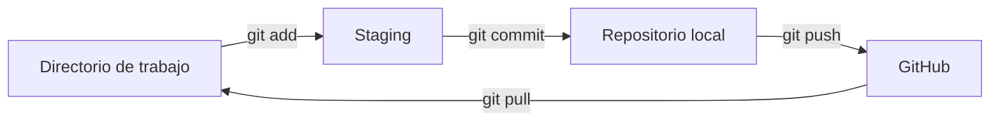
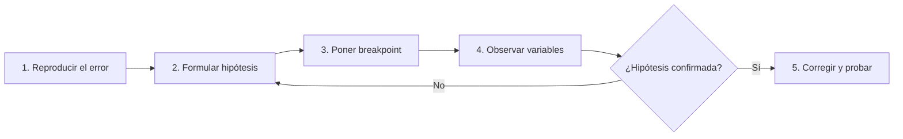

# Tema 6.1: Buenas Prácticas en el Desarrollo Seguro de Software

**Manejo de errores, depuración y validación de entradas, mediante la introducción a Git y GitHub**

Este documento resume los contenidos vistos en clase. Todos los ejemplos están escritos en **C#** y **Git**.

## Objetivos de aprendizaje

Al finalizar este tema serás capaz de:

- Utilizar **Git y GitHub** para versionar código y colaborar.
- **Validar** toda entrada del usuario antes de procesarla.
- **Manejar errores** sin exponer información sensible.
- **Depurar** un programa aplicando un método sistemático.

## Contenido

1. [Introducción y planteamiento del problema](#1-introducción-y-planteamiento-del-problema)
2. [Introducción a Git y GitHub](#2-introducción-a-git-y-github)
3. [Validación de entradas](#3-validación-de-entradas)
4. [Manejo de errores](#4-manejo-de-errores)
5. [Depuración](#5-depuración)
6. [Práctica y evaluación](#6-práctica-y-evaluación)

---

## 1. Introducción y planteamiento del problema

Considera el siguiente programa:

```csharp
Console.Write("Ingrese su edad: ");
int edad = int.Parse(Console.ReadLine());
Console.WriteLine($"Nació aproximadamente en {DateTime.Now.Year - edad}");
```

| Entrada | Resultado |
|---|---|
| `abc` | `FormatException` |
| *(vacío)* | `ArgumentNullException` |
| `99999999999` | `OverflowException` |
| `-5` | Funciona, pero el resultado no tiene sentido |

> **Idea central:** toda entrada del usuario es potencialmente errónea u hostil. Un sistema seguro nunca debe asumir lo contrario.

---

## 2. Introducción a Git y GitHub

### ¿Por qué usar control de versiones?

- **Historial:** registro de quién cambió qué, cuándo y por qué.
- **Reversibilidad:** permite volver a una versión anterior.
- **Colaboración:** varias personas trabajan sin pisarse el código.
- **Trazabilidad:** fundamental en seguridad para auditar cambios.

### Flujo básico



### Crear el primer repositorio

```bash
dotnet new console -n ValidacionDemo
cd ValidacionDemo
dotnet new gitignore            # evita subir bin/ y obj/
git init
git add .
git commit -m "Versión inicial (sin validación)"
git branch -M main
git remote add origin https://github.com/usuario/ValidacionDemo.git
git push -u origin main
```

### Comandos frecuentes

| Comando | Función |
|---|---|
| `git status` | Muestra qué archivos cambiaron |
| `git diff` | Muestra los cambios línea por línea |
| `git add <archivo>` | Prepara un archivo para el commit |
| `git commit -m "mensaje"` | Guarda una versión |
| `git log --oneline` | Muestra el historial resumido |
| `git pull` | Trae cambios desde GitHub |
| `git push` | Sube cambios a GitHub |

### Ramas y Pull Requests

```bash
git checkout -b feature/validaciones
git push -u origin feature/validaciones
# En GitHub: abrir un Pull Request para que otra persona revise el código
```

### Seguridad: nunca subas secretos

Contraseñas, cadenas de conexión y claves de API **no deben** escribirse en el código.

```csharp
// Incorrecto: queda en el historial de Git para siempre
var cadena = "Server=prod;User=sa;Password=Admin123;";
```

```bash
# Correcto: guardar secretos fuera del código
dotnet user-secrets init
dotnet user-secrets set "ConnectionStrings:Db" "Server=...;Password=..."
```

```csharp
// Alternativa: variables de entorno
var cadena = Environment.GetEnvironmentVariable("DB_CONNECTION");
```

> Si subes un secreto por error, **cámbialo de inmediato**. Borrar el commit no es suficiente.

---

## 3. Validación de entradas

### Principios

- Usar **lista blanca**: aceptar solo lo esperado, en lugar de intentar bloquear lo malicioso.
- Validar **tipo, rango, longitud y formato**.
- Validar siempre **en el servidor**, no solo en la interfaz.
- Rechazar por defecto y aceptar por excepción.

### Del código frágil al seguro

```csharp
// Antes
int edad = int.Parse(Console.ReadLine());

// Después: TryParse + validación de rango
int edad;
while (true)
{
    Console.Write("Ingrese su edad: ");
    if (int.TryParse(Console.ReadLine(), out edad) && edad >= 0 && edad <= 120)
        break;
    Console.WriteLine("Edad inválida (0-120).");
}
```

### Método reutilizable

```csharp
static int LeerEntero(string mensaje, int min, int max)
{
    while (true)
    {
        Console.Write(mensaje);
        string? entrada = Console.ReadLine();

        if (int.TryParse(entrada, out int valor) && valor >= min && valor <= max)
            return valor;

        Console.WriteLine($"Entrada inválida. Ingrese un número entre {min} y {max}.");
    }
}

int edad = LeerEntero("Ingrese su edad: ", 0, 120);
```

### Validación de formato con expresiones regulares

```csharp
using System.Text.RegularExpressions;

static bool EmailValido(string email) =>
    Regex.IsMatch(email,
        @"^[^@\s]+@[^@\s]+\.[^@\s]+$",
        RegexOptions.None, TimeSpan.FromMilliseconds(100));

static bool NombreValido(string? nombre) =>
    !string.IsNullOrWhiteSpace(nombre) && nombre.Length <= 50
    && Regex.IsMatch(nombre, @"^[\p{L} ]+$");
```

El **timeout** protege contra ataques de denegación de servicio por expresiones regulares (ReDoS).

### Inyección SQL

```csharp
// Vulnerable: concatenación de texto
var sql = "SELECT * FROM Usuarios WHERE Nombre = '" + nombre + "'";
var cmd = new SqlCommand(sql, conexion);
```

Si `nombre` vale `' OR '1'='1`, la consulta resultante devuelve **todos** los usuarios:

```sql
SELECT * FROM Usuarios WHERE Nombre = '' OR '1'='1'
```

```csharp
// Seguro: consulta parametrizada
var cmd = new SqlCommand("SELECT * FROM Usuarios WHERE Nombre = @nombre", conexion);
cmd.Parameters.AddWithValue("@nombre", nombre);
```

Con parámetros, el dato **nunca se interpreta como código**.

### Guardar el avance

```bash
git add .
git commit -m "Agrega validación de entradas"
```

> Un buen mensaje de commit indica **qué** cambió y **por qué**.

---

## 4. Manejo de errores

### try / catch / finally

```csharp
try
{
    using var lector = new StreamReader("datos.txt");
    Console.WriteLine(lector.ReadToEnd());
}
catch (FileNotFoundException)
{
    Console.WriteLine("No se encontró el archivo solicitado.");
}
catch (IOException ex)
{
    Logger.Registrar(ex);   // detalle técnico solo en el log
    Console.WriteLine("Ocurrió un problema al leer el archivo.");
}
catch (Exception ex)
{
    Logger.Registrar(ex);
    Console.WriteLine("Error inesperado. Intente más tarde.");
}
```

Captura primero las excepciones **específicas** y deja `Exception` al final.

### No mostrar detalles técnicos al usuario

Mostrar el contenido de una excepción es una **fuga de información**: revela rutas, nombres de usuario, consultas y versiones.

```csharp
// Incorrecto
catch (Exception ex)
{
    Console.WriteLine(ex.ToString());
}

// Correcto: registro interno + mensaje genérico
catch (Exception ex)
{
    Logger.Registrar(ex);
    Console.WriteLine("Ocurrió un error. Contacte a soporte.");
}
```

### `throw` vs `throw ex`

```csharp
try
{
    ProcesarPago();
}
catch (Exception)
{
    throw;        // Correcto: conserva la traza original
    // throw ex;  // Incorrecto: reinicia la traza
}
```

Sin la traza original, depurar el error resulta mucho más difícil.

### Excepciones personalizadas

```csharp
public class SaldoInsuficienteException : Exception
{
    public SaldoInsuficienteException(decimal saldo, decimal monto)
        : base($"Saldo insuficiente: disponible {saldo}, solicitado {monto}") { }
}

public void Retirar(decimal monto)
{
    if (monto <= 0)
        throw new ArgumentOutOfRangeException(nameof(monto), "El monto debe ser positivo.");
    if (monto > Saldo)
        throw new SaldoInsuficienteException(Saldo, monto);

    Saldo -= monto;
}

// Uso
try { cuenta.Retirar(500); }
catch (SaldoInsuficienteException) { Console.WriteLine("No tiene saldo suficiente."); }
```

### Guardar el avance en una rama

```bash
git checkout -b feature/manejo-errores
git commit -am "Agrega manejo de excepciones con logging seguro"
git push -u origin feature/manejo-errores
```

---

## 5. Depuración

Depurar es un **método**, no adivinar. Se formula una hipótesis, se observan los valores y se confirma o descarta.

### Ejemplo con un error intencional

```csharp
int[] notas = { 70, 85, 90, 65, 100 };
int suma = 0;
for (int i = 0; i <= notas.Length; i++)   // ¿Qué falla?
{
    suma += notas[i];
}
Console.WriteLine($"Promedio: {suma / notas.Length}");
```

```text
System.IndexOutOfRangeException: Index was outside the bounds of the array.
```

**Solución:** cambiar la condición a `i < notas.Length`.

### Herramientas de Visual Studio

| Herramienta | Atajo | Uso |
|---|---|---|
| Breakpoint | `F9` | Pausar la ejecución en una línea |
| Step Over | `F10` | Ejecutar la línea sin entrar al método |
| Step Into | `F11` | Entrar al método |
| Step Out | `Shift+F11` | Salir del método actual |
| Continue | `F5` | Seguir hasta el siguiente breakpoint |

- **Ventanas clave:** `Locals`, `Watch` y `Call Stack`.
- **Breakpoint condicional:** clic derecho sobre el breakpoint, *Conditions*, y escribir por ejemplo `i == notas.Length`.

### Pasos del método de depuración



### Ayudas en el código

```csharp
System.Diagnostics.Debug.WriteLine($"i = {i}, suma = {suma}");   // solo en Debug
System.Diagnostics.Debug.Assert(i < notas.Length, "Índice fuera de rango");
```

**Debug vs Release:** en la compilación Release se eliminan las llamadas a `Debug.*` y se optimiza el código.

---

## 6. Práctica y evaluación

### Ejercicio en parejas: sistema de registro de estudiantes

```csharp
public class Estudiante
{
    public string Nombre { get; set; }
    public int Edad { get; set; }
    public string Correo { get; set; }
}
```

**Requisitos:**

1. Validar nombre, edad (16 a 100) y correo electrónico.
2. Manejar errores sin mostrar detalles técnicos.
3. Subir el proyecto a GitHub con **mínimo 3 commits** con mensajes claros.
4. *(Opcional)* Crear la rama `feature/validaciones` y abrir un **Pull Request** revisado por tu compañero.

**Ejemplo de commits esperados:**

```bash
git commit -m "Crea clase Estudiante y menú principal"
git commit -m "Agrega validación de nombre, edad y correo"
git commit -m "Agrega manejo de excepciones y logging"
```

### Rúbrica

| Criterio | Peso |
|---|---|
| Validación de entradas | 40% |
| Manejo de errores | 30% |
| Uso de Git y GitHub | 30% |

---

## Resumen

- **Valida** todo: tipo, rango, longitud y formato.
- **Maneja errores** con excepciones específicas y sin filtrar información.
- **Depura** con hipótesis y con las herramientas del IDE.
- **Versiona** con Git y nunca subas secretos.

## Referencias

- [Documentación de C#](https://learn.microsoft.com/dotnet/csharp/)
- [Manejo de excepciones en .NET](https://learn.microsoft.com/dotnet/standard/exceptions/)
- [Pro Git (libro gratuito)](https://git-scm.com/book/es/v2)
- [OWASP Top 10](https://owasp.org/www-project-top-ten/)