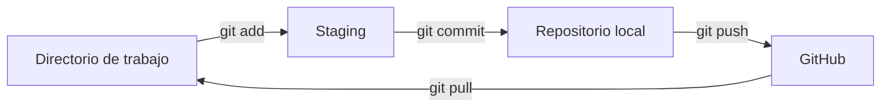
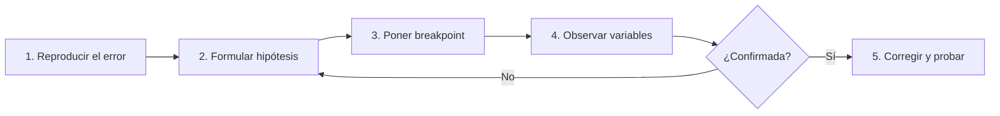

# Buenas Prácticas en el Desarrollo Seguro

Tema 6.1 · Manejo de errores, depuración y validación de entradas

<div class="pt-8 opacity-70">
C# · Git · GitHub
</div>

<!--
Ejecutar con: npm init slidev@latest  -> reemplazar slides.md -> npm run dev
-->

---
layout: center
class: text-center
---

# 🎯 Objetivos de hoy

<v-clicks>

- Usar **Git y GitHub** para versionar nuestro código
- **Validar** toda entrada del usuario
- **Manejar errores** sin filtrar información sensible
- **Depurar** con método, no adivinando

</v-clicks>

---
layout: section
---

# 1. Introducción y planteamiento del problema
Vulnerabilidades por entradas no controladas

---

# ¿Qué tan frágil es este código?

```csharp {all|1|2|3}
Console.Write("Ingrese su edad: ");
int edad = int.Parse(Console.ReadLine());
Console.WriteLine($"Nació aproximadamente en {DateTime.Now.Year - edad}");
```

<v-click>

### Pruébenlo con:

| Entrada | Resultado |
|---|---|
| `abc` | 💥 `FormatException` |
| *(vacío)* | 💥 `ArgumentNullException` |
| `99999999999` | 💥 `OverflowException` |
| `-5` | ⚠️ Funciona, pero sin sentido |

</v-click>

<v-click>

> **Regla de oro:** toda entrada del usuario es potencialmente errónea u hostil.

</v-click>

---
layout: section
---

# 2. Git y GitHub
Historial, colaboración y trazabilidad

---

# ¿Por qué usar control de versiones?

<v-clicks>

- 📜 **Historial** de cada cambio: quién, cuándo y por qué
- ⏪ Poder **volver atrás** ante un error
- 👥 **Trabajo en equipo** sin pisarnos el código
- 🔍 **Trazabilidad**: clave en seguridad para auditar cambios

</v-clicks>

<div class="mt-8">



</div>

---

# Primer repositorio (demo en vivo)

```bash {all|1|2|3-4|5-6|7-9}
dotnet new console -n ValidacionDemo
cd ValidacionDemo
dotnet new gitignore
git init
git add .
git commit -m "Versión inicial (sin validación)"
git branch -M main
git remote add origin https://github.com/usuario/ValidacionDemo.git
git push -u origin main
```

<v-click>

💡 `dotnet new gitignore` evita subir las carpetas `bin/` y `obj/`.

</v-click>

---

# Comandos del día a día

```bash
git status                 # ¿Qué cambió?
git diff                   # Ver los cambios línea por línea
git add Program.cs         # Preparar un archivo
git commit -m "mensaje"    # Guardar una versión
git log --oneline          # Ver el historial resumido
git pull                   # Traer cambios de GitHub
git push                   # Subir cambios a GitHub
```

<v-click>

### Trabajar con ramas

```bash
git checkout -b feature/validaciones   # Crear y cambiar de rama
git push -u origin feature/validaciones
# En GitHub: abrir un Pull Request para que otro lo revise
```

</v-click>

---

# 🔐 Seguridad en Git: nunca subir secretos

```csharp
// ❌ NUNCA: quedaría en el historial para siempre
var cadena = "Server=prod;User=sa;Password=Admin123;";
```

```bash
# ✅ Guardar secretos fuera del código
dotnet user-secrets init
dotnet user-secrets set "ConnectionStrings:Db" "Server=...;Password=..."
```

```csharp
// ✅ Leerlos desde variables de entorno
var cadena = Environment.GetEnvironmentVariable("DB_CONNECTION");
```

<v-click>

> Si subes un secreto por error, **cámbialo de inmediato**: borrar el commit no basta.

</v-click>

---
layout: section
---

# 3. Validación de entradas
Nunca confíes en el usuario

---

# Principios de validación

<v-clicks>

- ✅ **Lista blanca**: aceptar solo lo esperado, en lugar de bloquear lo malo
- 🔎 Validar **tipo, rango, longitud y formato**
- 🖥️ Validar **siempre en el servidor**, no solo en la interfaz
- 🚫 Rechazar por defecto y aceptar por excepción

</v-clicks>

---

# Del código frágil al seguro

````md magic-move {lines: true}
```csharp
// ❌ Antes
int edad = int.Parse(Console.ReadLine());
```

```csharp
// ✅ Después: TryParse + rango
int edad;
while (true)
{
    Console.Write("Ingrese su edad: ");
    if (int.TryParse(Console.ReadLine(), out edad)
        && edad >= 0 && edad <= 120)
        break;
    Console.WriteLine("Edad inválida (0-120).");
}
```
````

---

# Método reutilizable

```csharp {all|1|5-9|11}
static int LeerEntero(string mensaje, int min, int max)
{
    while (true)
    {
        Console.Write(mensaje);
        string? entrada = Console.ReadLine();

        if (int.TryParse(entrada, out int valor) && valor >= min && valor <= max)
            return valor;

        Console.WriteLine($"Entrada inválida. Ingrese un número entre {min} y {max}.");
    }
}

int edad = LeerEntero("Ingrese su edad: ", 0, 120);
```

---

# Validar texto y formato con Regex

```csharp {all|1|4-6|8-9}
using System.Text.RegularExpressions;

static bool EmailValido(string email) =>
    Regex.IsMatch(email,
        @"^[^@\s]+@[^@\s]+\.[^@\s]+$",
        RegexOptions.None, TimeSpan.FromMilliseconds(100));

static bool NombreValido(string? nombre) =>
    !string.IsNullOrWhiteSpace(nombre) && nombre.Length <= 50
    && Regex.IsMatch(nombre, @"^[\p{L} ]+$");
```

<v-click>

⏱️ El **timeout** en el Regex evita ataques de denegación de servicio (ReDoS).

</v-click>

---

# Inyección SQL

<div class="grid grid-cols-2 gap-4">
<div>

### ❌ Vulnerable

```csharp
var sql = "SELECT * FROM Usuarios " +
  "WHERE Nombre = '" + nombre + "'";
var cmd = new SqlCommand(sql, conexion);
```

<v-click>

Si `nombre` = `' OR '1'='1`

```sql
SELECT * FROM Usuarios
WHERE Nombre = '' OR '1'='1'
```

☠️ Devuelve **todos** los usuarios

</v-click>

</div>
<div>

<v-click>

### ✅ Consulta parametrizada

```csharp
var cmd = new SqlCommand(
  "SELECT * FROM Usuarios " +
  "WHERE Nombre = @nombre", conexion);
cmd.Parameters.AddWithValue(
  "@nombre", nombre);
```

El dato **nunca** se interpreta como código.

</v-click>

</div>
</div>

---

# Guardamos el avance con Git

```bash
git add .
git commit -m "Agrega validación de entradas"
git log --oneline
```

```text
a3f9c21 Agrega validación de entradas
7b1e0d4 Versión inicial (sin validación)
```

<v-click>

💡 Un buen mensaje de commit dice **qué** cambió y **por qué**.

</v-click>

---
layout: section
---

# 4. Manejo de errores
Fallar con elegancia

---

# try / catch / finally

```csharp {all|1-5|6-9|10-14|15-19}
try
{
    using var lector = new StreamReader("datos.txt");
    Console.WriteLine(lector.ReadToEnd());
}
catch (FileNotFoundException)
{
    Console.WriteLine("No se encontró el archivo solicitado.");
}
catch (IOException ex)
{
    Logger.Registrar(ex);   // detalle técnico solo en el log
    Console.WriteLine("Ocurrió un problema al leer el archivo.");
}
catch (Exception ex)
{
    Logger.Registrar(ex);
    Console.WriteLine("Error inesperado. Intente más tarde.");
}
```

<v-click>

⚠️ Captura primero las excepciones **específicas** y al final `Exception`.

</v-click>

---

# ❌ Lo que NO debes mostrar al usuario

```csharp
catch (Exception ex)
{
    // ❌ Fuga de información: rutas, consultas, versiones...
    Console.WriteLine(ex.ToString());
}
```

```text
System.Data.SqlClient.SqlException: Login failed for user 'sa'.
   at DAL.Conexion.Abrir() in C:\Proyectos\Banco\DAL\Conexion.cs:line 42
```

<v-click>

```csharp
catch (Exception ex)
{
    // ✅ Log interno + mensaje genérico
    Logger.Registrar(ex);
    Console.WriteLine("Ocurrió un error. Contacte a soporte.");
}
```

</v-click>

---

# throw vs throw ex

```csharp {all|5|10}
try
{
    ProcesarPago();
}
catch (Exception ex)
{
    throw;        // ✅ Conserva la traza original
}

// catch (Exception ex) { throw ex; }   // ❌ Reinicia la traza
```

<v-click>

Sin la traza original, **depurar se vuelve mucho más difícil**.

</v-click>

---

# Excepciones personalizadas

```csharp {all|1-5|7-20}
public class SaldoInsuficienteException : Exception
{
    public SaldoInsuficienteException(decimal saldo, decimal monto)
        : base($"Saldo insuficiente: disponible {saldo}, solicitado {monto}") { }
}

public void Retirar(decimal monto)
{
    if (monto <= 0)
        throw new ArgumentOutOfRangeException(nameof(monto), "El monto debe ser positivo.");
    if (monto > Saldo)
        throw new SaldoInsuficienteException(Saldo, monto);

    Saldo -= monto;
}

// Uso
try { cuenta.Retirar(500); }
catch (SaldoInsuficienteException) { Console.WriteLine("No tiene saldo suficiente."); }
```

---

# Commit y rama

```bash
git add .
git commit -m "Agrega manejo de excepciones con logging seguro"
git push
```

<v-click>

```bash
# Buena práctica: trabajar cambios en una rama
git checkout -b feature/manejo-errores
git commit -am "Agrega excepción SaldoInsuficienteException"
git push -u origin feature/manejo-errores
```

</v-click>

---
layout: section
---

# 5. Depuración
Método, no adivinanza

---

# Código con bug intencional

```csharp {all|3|5}
int[] notas = { 70, 85, 90, 65, 100 };
int suma = 0;
for (int i = 0; i <= notas.Length; i++)   // 🐛 ¿Qué falla?
{
    suma += notas[i];
}
Console.WriteLine($"Promedio: {suma / notas.Length}");
```

<v-click>

```text
System.IndexOutOfRangeException: Index was outside the bounds of the array.
```

**Solución:** `i < notas.Length`

</v-click>

---

# Herramientas de depuración en Visual Studio

| Herramienta | Atajo | Uso |
|---|---|---|
| Breakpoint | `F9` | Pausar en una línea |
| Step Over | `F10` | Ejecutar línea sin entrar |
| Step Into | `F11` | Entrar al método |
| Step Out | `Shift+F11` | Salir del método |
| Continue | `F5` | Seguir hasta el próximo breakpoint |

<v-click>

**Ventanas clave:** `Locals` · `Watch` · `Call Stack`

</v-click>

<v-click>

**Breakpoint condicional:** clic derecho en el breakpoint → *Conditions* → `i == notas.Length`

</v-click>

---

# Método de depuración



<v-click>

```csharp
// Ayudas adicionales en código
System.Diagnostics.Debug.WriteLine($"i = {i}, suma = {suma}"); // Solo en Debug
System.Diagnostics.Debug.Assert(i < notas.Length, "Índice fuera de rango");
```

</v-click>

<v-click>

⚙️ **Debug vs Release:** en Release se eliminan `Debug.*` y se optimiza el código.

</v-click>

---
layout: section
---

# 6. Práctica y cierre

---

# 🧪 Ejercicio en parejas

### Sistema de registro de estudiantes

```csharp
public class Estudiante
{
    public string Nombre { get; set; }
    public int Edad { get; set; }
    public string Correo { get; set; }
}
```

<v-clicks>

1. **Validar** nombre, edad (16-100) y correo
2. **Manejar errores** sin mostrar detalles técnicos
3. Subir a GitHub con **mínimo 3 commits** con mensajes claros
4. *(Extra)* Rama `feature/validaciones` + **Pull Request** revisado por tu compañero

</v-clicks>

---

# Commits esperados

```bash
git commit -m "Crea clase Estudiante y menú principal"
git commit -m "Agrega validación de nombre, edad y correo"
git commit -m "Agrega manejo de excepciones y logging"
```

<div class="mt-6">

### Rúbrica

| Criterio | Peso |
|---|---|
| Validación de entradas | 40% |
| Manejo de errores | 30% |
| Uso de Git/GitHub | 30% |

</div>

---
layout: center
class: text-center
---

# ✅ Resumen

<v-clicks>

- 🔒 **Valida** todo: tipo, rango, longitud y formato
- 🧯 **Maneja errores** con excepciones específicas y sin filtrar datos
- 🐞 **Depura** con hipótesis y herramientas
- 🌿 **Versiona** con Git y nunca subas secretos

</v-clicks>

<v-click>

### ¿Qué tres cosas cambiarán en cómo programan desde hoy?

</v-click>

---
layout: end
---

# ¡Gracias!

Preguntas y comentarios