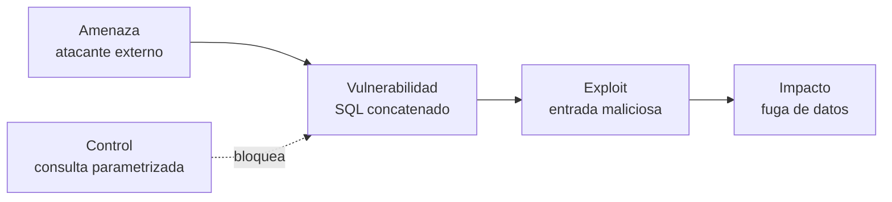

# 6.2 Evaluar código existente

Identificar fallas de seguridad y proponer mejoras en **C#**

<div class="pt-6 opacity-70">
Tema 6: Buenas Prácticas en el Desarrollo Seguro de Software
</div>

---

# Objetivos de la sesión

- Diferenciar **amenaza, vulnerabilidad, exploit y riesgo**
- Aplicar un **proceso sistemático** de revisión de seguridad de código
- Reconocer las **vulnerabilidades más comunes** (OWASP Top 10) en C#
- Comparar código **vulnerable vs. código corregido**
- Usar **herramientas** para detectar fallas automáticamente
- Practicar con **ejercicios** de revisión y corrección

<div class="mt-6 text-sm opacity-70">
Continuación del 6.1: manejo de errores, validación de entradas y Git/GitHub.
</div>

---

# Conceptos clave de seguridad

| Concepto | Definición | Ejemplo |
|---|---|---|
| **Activo** | Lo que se quiere proteger | Base de datos de clientes |
| **Amenaza** | Posible evento o actor que puede causar daño | Un atacante externo, malware |
| **Vulnerabilidad** | Debilidad que puede ser aprovechada | Consulta SQL concatenada |
| **Exploit** | Técnica o código que aprovecha la vulnerabilidad | `' OR '1'='1` |
| **Ataque** | Acción real que explota la vulnerabilidad | Extraer todos los usuarios |
| **Riesgo** | Probabilidad × impacto de que ocurra el daño | Fuga de datos personales |
| **Control** | Medida que reduce el riesgo | Consultas parametrizadas |

---
layout: two-cols
---

# Amenaza vs. vulnerabilidad

### Analogía: una casa

- **Activo:** lo que hay dentro
- **Amenaza:** un ladrón que ronda
- **Vulnerabilidad:** una puerta sin cerradura
- **Riesgo:** que entre y robe
- **Control:** instalar una cerradura

::right::

<div class="pl-4">

### La relación

- Sin **vulnerabilidad**, la amenaza no puede hacer daño
- Sin **amenaza**, la vulnerabilidad existe pero no se explota (aún)
- Como desarrolladores controlamos sobre todo las **vulnerabilidades**: no podemos eliminar a los atacantes

<div class="mt-4 p-3 border rounded">
<b>Riesgo = Amenaza × Vulnerabilidad × Impacto</b>
</div>

</div>

---

# De la vulnerabilidad al daño: un caso en C#



- **Activo:** tabla `Usuarios` con datos personales
- **Riesgo:** alto, porque es fácil de explotar y el impacto es grave
- **Decisión:** corregir en código (control preventivo) en lugar de aceptar el riesgo

---

# Triada CIA: ¿qué se ve afectado?

| Propiedad | Significa | Vulnerabilidad típica |
|---|---|---|
| **Confidencialidad** | Solo accede quien debe | IDOR, secretos expuestos |
| **Integridad** | Los datos no se alteran sin permiso | SQL Injection, deserialización insegura |
| **Disponibilidad** | El sistema funciona cuando se necesita | Sin límites de tamaño o de intentos |

Todo hallazgo de seguridad se puede describir indicando **qué propiedad compromete**.

---

# Cómo se catalogan y miden

- **CWE** (*Common Weakness Enumeration*): catálogo de **tipos de debilidad**
  Ej.: CWE-89 = SQL Injection
- **CVE** (*Common Vulnerabilities and Exposures*): identificador de una **vulnerabilidad concreta** en un producto
  Ej.: CVE-AAAA-NNNN
- **CVSS**: puntaje de severidad de **0 a 10** (Baja, Media, Alta, Crítica)
- **OWASP Top 10**: lista de las categorías de riesgo más comunes en aplicaciones web

<div class="mt-4 text-sm opacity-70">
Usaremos estas referencias al clasificar los hallazgos en los ejercicios.
</div>

---

# ¿Por qué revisar código existente?

- La mayoría de vulnerabilidades nacen de **errores de codificación**, no de la infraestructura
- Corregir en desarrollo cuesta **mucho menos** que corregir en producción
- El código heredado suele tener **deuda de seguridad**
- Revisar = leer el código con **mentalidad de atacante**

> Pregunta guía: *"¿Qué pasa si esta entrada es maliciosa?"*

---

# Proceso de revisión de seguridad

1. **Entender** qué hace el código y qué datos maneja
2. **Identificar entradas** no confiables (formularios, URL, archivos, APIs)
3. **Rastrear el flujo** de esos datos hasta donde se usan (BD, archivos, pantalla)
4. **Buscar patrones peligrosos** (concatenar SQL, secretos, cripto débil)
5. **Clasificar** el hallazgo: severidad e impacto
6. **Proponer y aplicar** la corrección
7. **Verificar** (pruebas, re-análisis) y documentar en GitHub (issue / PR)

---

# OWASP Top 10: vulnerabilidades frecuentes

| Categoría | Ejemplo en C# |
|---|---|
| Inyección | SQL concatenado con `string` |
| Control de acceso roto | Acceder a `/pedido/15` sin verificar dueño |
| Fallas criptográficas | MD5 para contraseñas |
| Diseño inseguro | Sin límites de intentos de login |
| Configuración incorrecta | Errores detallados en producción |
| Componentes vulnerables | Paquetes NuGet desactualizados |
| Fallas de autenticación | Contraseñas débiles permitidas |
| Integridad de datos | Deserialización insegura |
| Logging insuficiente | Sin registro de accesos fallidos |

---
layout: two-cols
---

# Inyección SQL

### ❌ Vulnerable

```csharp
string sql = "SELECT * FROM Usuarios " +
  "WHERE Nombre = '" + nombre + "'";
var cmd = new SqlCommand(sql, conn);
```

Si `nombre = ' OR '1'='1` se devuelven **todos** los usuarios.

::right::

<div class="pl-4">

### ✅ Corregido

```csharp
string sql = "SELECT * FROM Usuarios " +
  "WHERE Nombre = @nombre";
var cmd = new SqlCommand(sql, conn);
cmd.Parameters.AddWithValue(
  "@nombre", nombre);
```

**Regla:** nunca concatenar entradas en consultas. Usar **consultas parametrizadas** o un ORM (Entity Framework).

</div>

---

# Inyección SQL con Entity Framework

```csharp
// ❌ Vulnerable: interpolación en SQL crudo
var r = db.Usuarios
  .FromSqlRaw($"SELECT * FROM Usuarios WHERE Nombre = '{nombre}'");

// ✅ Seguro: FromSqlInterpolated parametriza automáticamente
var r = db.Usuarios
  .FromSqlInterpolated($"SELECT * FROM Usuarios WHERE Nombre = {nombre}");

// ✅ Mejor aún: LINQ
var r = db.Usuarios.Where(u => u.Nombre == nombre).ToList();
```

<div class="text-sm opacity-70 mt-4">
LINQ genera consultas parametrizadas por defecto.
</div>

---

# Secretos en el código (hardcoded)

```csharp
// ❌ Vulnerable: queda en Git para siempre
string conn = "Server=prod;User=sa;Password=Admin123;";
string apiKey = "sk_live_9f8a7b6c";
```

```csharp
// ✅ Variables de entorno / User Secrets / Key Vault
string conn = Environment.GetEnvironmentVariable("DB_CONN");
// En desarrollo: dotnet user-secrets set "DB:Conn" "valor"
string apiKey = config["Api:Key"];
```

- Añadir archivos sensibles a `.gitignore`
- Si un secreto se subió a GitHub: **revocarlo y rotarlo** (borrar el commit no basta)

---
layout: two-cols
---

# Criptografía débil

### ❌ Vulnerable

```csharp
using var md5 = MD5.Create();
byte[] hash = md5.ComputeHash(
  Encoding.UTF8.GetBytes(password));
```

MD5 y SHA1 son **rápidos y rompibles**; sin *salt* son vulnerables a tablas rainbow.

::right::

<div class="pl-4">

### ✅ Corregido

```csharp
byte[] salt = RandomNumberGenerator
  .GetBytes(16);
byte[] hash = Rfc2898DeriveBytes.Pbkdf2(
  password, salt, 600_000,
  HashAlgorithmName.SHA256, 32);
// Guardar salt + hash
```

Alternativas: **BCrypt**, **Argon2**, o `PasswordHasher` de ASP.NET Identity.

</div>

---

# Control de acceso roto (IDOR)

```csharp
// ❌ Cualquier usuario autenticado ve cualquier pedido
[HttpGet("pedido/{id}")]
public IActionResult Get(int id) =>
    Ok(db.Pedidos.Find(id));
```

```csharp
// ✅ Verificar que el recurso pertenece al usuario
[Authorize]
[HttpGet("pedido/{id}")]
public IActionResult Get(int id)
{
    var userId = User.FindFirstValue(ClaimTypes.NameIdentifier);
    var pedido = db.Pedidos
        .FirstOrDefault(p => p.Id == id && p.UsuarioId == userId);
    return pedido is null ? NotFound() : Ok(pedido);
}
```

---

# XSS y salida de datos

- **XSS**: el atacante inyecta `<script>` que se ejecuta en el navegador de otros usuarios
- Razor **codifica la salida por defecto**; el riesgo aparece al desactivarlo

```csharp
// ❌ Vulnerable
@Html.Raw(Model.Comentario)

// ✅ Seguro: Razor codifica automáticamente
@Model.Comentario

// ✅ Codificación manual cuando haga falta
string seguro = System.Net.WebUtility.HtmlEncode(entrada);
```

**Principio:** validar la *entrada* y codificar la *salida*.

---

# Path Traversal (acceso a archivos)

```csharp
// ❌ Vulnerable: archivo = "..\..\appsettings.json"
var ruta = Path.Combine("C:\\uploads", archivo);
return File.ReadAllBytes(ruta);
```

```csharp
// ✅ Normalizar y verificar que siga dentro del directorio base
var baseDir = Path.GetFullPath("C:\\uploads");
var ruta = Path.GetFullPath(Path.Combine(baseDir, archivo));
if (!ruta.StartsWith(baseDir + Path.DirectorySeparatorChar))
    throw new UnauthorizedAccessException();
return File.ReadAllBytes(ruta);
```

También: validar extensiones permitidas y usar nombres generados (`Guid`).

---

# Manejo de errores y logging seguro

```csharp
// ❌ Expone detalles internos y datos sensibles
catch (Exception ex)
{
    return BadRequest(ex.ToString());      // stack trace al usuario
    _log.LogInformation($"Login: {user} / {password}");
}
```

```csharp
// ✅ Mensaje genérico al usuario, detalle solo en el log
catch (Exception ex)
{
    _log.LogError(ex, "Error procesando solicitud {Id}", id);
    return StatusCode(500, "Ocurrió un error. Intente más tarde.");
}
```

**Nunca** registrar contraseñas, tokens ni datos personales completos.

---

# Deserialización y componentes vulnerables

- `BinaryFormatter` está **obsoleto e inseguro**: no usarlo con datos externos
- Preferir `System.Text.Json` con **tipos concretos** (no `object`)
- Mantener las dependencias actualizadas:

```bash
dotnet list package --vulnerable --include-transitive
dotnet list package --outdated
```

- Activar **Dependabot** en GitHub para recibir alertas y PRs automáticos

---

# Herramientas de análisis

| Herramienta | Uso |
|---|---|
| **Roslyn Analyzers** (`dotnet build`) | Reglas de seguridad `CA2100`, `CA5350`, `CA5351`… |
| **SonarQube / SonarCloud** | Análisis estático (SAST) y *security hotspots* |
| **GitHub CodeQL** | Escaneo de código en cada push / PR |
| **Semgrep** | Reglas personalizables por patrón |
| **Dependabot** | Vulnerabilidades en paquetes NuGet |
| **gitleaks** | Detección de secretos en el repositorio |

<div class="mt-4 text-sm opacity-70">
Las herramientas dan falsos positivos: la revisión humana sigue siendo necesaria.
</div>

---

# Checklist de revisión rápida

- [ ] ¿Toda entrada externa se **valida** (tipo, longitud, formato, lista blanca)?
- [ ] ¿Las consultas son **parametrizadas**?
- [ ] ¿Hay **secretos** en el código o en el historial de Git?
- [ ] ¿Contraseñas con **hash + salt** modernos?
- [ ] ¿Se verifica **autorización** en cada recurso?
- [ ] ¿La salida se **codifica** (HTML, URL)?
- [ ] ¿Los errores **no revelan** detalles internos?
- [ ] ¿Se registran eventos de seguridad **sin datos sensibles**?
- [ ] ¿Paquetes NuGet **actualizados**?

---
layout: section
---

# Ejercicios prácticos

Encuentra la falla, explica el riesgo y corrige el código

---

# Ejercicio 1: Login

Identifica **al menos 3 vulnerabilidades**:

```csharp
public bool Login(string user, string pass)
{
    string sql = "SELECT COUNT(*) FROM Usuarios WHERE Nombre='"
        + user + "' AND Clave='" + pass + "'";
    var cmd = new SqlCommand(sql, conn);
    try { return (int)cmd.ExecuteScalar() > 0; }
    catch (Exception ex)
    {
        Console.WriteLine("Error: " + ex + " " + sql);
        return false;
    }
}
```

**Tareas:** (a) listar fallas, (b) clasificar severidad, (c) reescribir el método.

---

# Ejercicio 2: Subida de archivos

```csharp
[HttpPost("subir")]
public async Task<IActionResult> Subir(IFormFile archivo, string carpeta)
{
    var ruta = Path.Combine("C:\\datos", carpeta, archivo.FileName);
    using var fs = new FileStream(ruta, FileMode.Create);
    await archivo.CopyToAsync(fs);
    return Ok("Guardado en " + ruta);
}
```

**Pistas:** ¿qué pasa con `carpeta = "..\\.."`? ¿y con `archivo.exe`? ¿hay límite de tamaño? ¿se revela la ruta interna?

**Tareas:** proponer 4 mejoras y escribir la versión segura.

---

# Ejercicio 3: Configuración y contraseñas

```csharp
public class Config
{
    public const string ApiKey = "AKIA9X8Y7Z-SECRETA";
    public const string Db = "Server=.;User=sa;Password=1234;";
}

public string GuardarClave(string clave)
{
    return Convert.ToBase64String(
        SHA1.HashData(Encoding.UTF8.GetBytes(clave)));
}
```

**Tareas:**
1. Explicar por qué **nunca** debe estar así en Git
2. Mover los secretos a `user-secrets` / variables de entorno
3. Reemplazar `SHA1` por `PBKDF2` o `PasswordHasher`
4. Simular un commit con el secreto y usar **gitleaks** para detectarlo

---

# Ejercicio 4: Revisión en equipo (GitHub)

1. Hacer *fork* del repositorio con el código de práctica del docente
2. Ejecutar `dotnet build` y revisar las **advertencias de análisis**
3. Activar **CodeQL** en la pestaña *Security* del repositorio
4. Crear **un issue por hallazgo**: descripción, severidad, línea afectada
5. Corregir en una rama `fix/seguridad-*` y abrir un **Pull Request**
6. Un compañero revisa el PR con la **checklist** de esta sesión

**Entregable:** reporte breve con hallazgos, correcciones y evidencia (capturas / enlaces a PR).

---

# Pistas para las soluciones

<v-clicks>

- **Ej. 1:** SQLi, contraseña en texto plano, `ex` y SQL expuestos en consola → parámetros, hash, log genérico
- **Ej. 2:** path traversal, sin validar extensión/tamaño, ruta revelada → `Path.GetFullPath`, lista blanca, `Guid` como nombre, `[RequestSizeLimit]`
- **Ej. 3:** secretos hardcodeados y SHA1 sin salt → `user-secrets`, PBKDF2/BCrypt, rotar credenciales
- **Ej. 4:** evaluar claridad del reporte, severidad asignada y calidad de la corrección

</v-clicks>

---
layout: center
class: text-center
---

# Conclusiones

Revisar con mentalidad de atacante · Validar entradas · Parametrizar consultas<br>
Proteger secretos · Cifrar bien · Autorizar siempre · Automatizar el análisis

<div class="pt-8 opacity-70">
Siguiente paso: aplicar estas prácticas en el proyecto integrador
</div>

<!--
Ejecutar con: npm init slidev@latest  (o pegar este archivo como slides.md) y luego npx slidev
-->